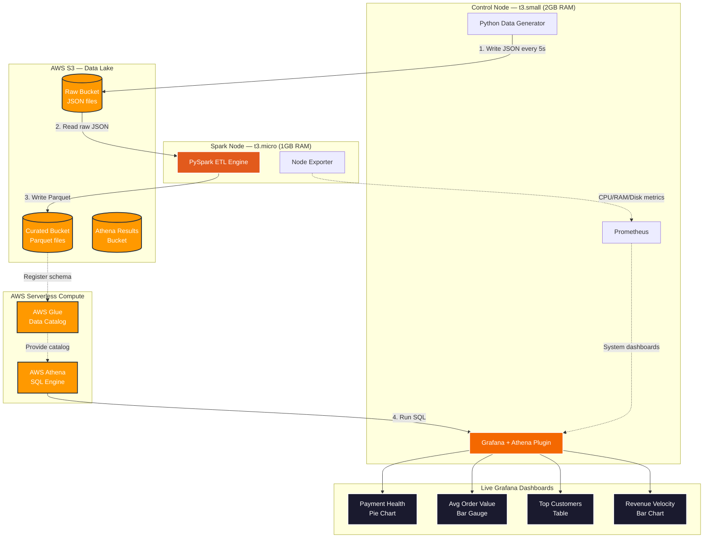

# AWS DataOps Pipeline — Real-Time Data Lakehouse on Free Tier

A real-time data pipeline and analytics project built entirely on the **AWS Free Tier** using two EC2 instances. It ingests fake e-commerce transactions, transforms them using PySpark, and visualizes the results through a live Grafana dashboard powered by AWS Athena.

> Built this while dealing with RAM constraints, Grafana UI bugs in v11, Athena workgroup errors, SSH key issues, and IAM permission errors — all documented below.

---

## 📐 Architecture

The biggest challenge was running everything on Free Tier (1–2 GB RAM per node). Running Spark, Grafana, and Prometheus all on one machine would crash it. So the project is split into **two EC2 nodes** that communicate over a private VPC network.



### Control Node (`t3.small`)
- Runs the **Python data generator** — writes a fake transaction to S3 every 5 seconds
- Runs **Prometheus** — scrapes system metrics from both nodes
- Runs **Grafana** — shows both system health and business dashboards

### Spark Node (`t3.micro`)
- Runs **PySpark** inside a Jupyter Docker container — reads raw JSON from S3 and converts it to Parquet format
- Runs **Node Exporter** — exposes CPU/RAM/Disk metrics to Prometheus on the Control Node over private IP

---

## 🛠️ Tech Stack

| Layer | Tools Used |
|-------|------------|
| Infrastructure | Terraform, AWS EC2, VPC, S3, IAM |
| Data Generation | Python, Boto3 |
| ETL / Transform | Apache Spark (PySpark), Parquet |
| Query Engine | AWS Athena, AWS Glue Data Catalog |
| Observability | Prometheus, Node Exporter |
| Dashboards | Grafana, Grafana Athena Plugin |
| Containers | Docker, Docker Compose |

---

## 🌊 How the Data Flows

1. **Generator** → `stream_data.py` runs on the Control Node, generates fake transactions (Customer, Category, Amount, Status) and writes each one as a JSON file to the **Raw S3 bucket** every 5 seconds.

2. **PySpark ETL** → `jupyter_pipeline.ipynb` running on the Spark Node reads those JSON files, validates the schema, filters out bad records (null IDs, negative amounts), and writes clean **Parquet files** into the **Curated S3 bucket**.

3. **Athena** → We ran a `CREATE EXTERNAL TABLE` SQL query once in Grafana's Explore tab. This tells AWS Glue to register the Parquet files as a SQL table. After that, Athena can query the S3 data like a regular database.

4. **Grafana** → Pulls data from Athena using SQL queries and renders it as charts on the dashboard. The Athena data source is auto-provisioned via a config file so you don't need to configure it manually.

---

## 📊 Dashboard Panels

All 4 panels are powered by Athena SQL queries running against the live Parquet data in S3.

### 1. Revenue by Category (Bar Chart)
```sql
SELECT product_category, sum(amount) as total_revenue
FROM default.transactions
WHERE payment_status = 'SUCCESS'
GROUP BY product_category
ORDER BY total_revenue DESC;
```

### 2. Payment Health — Success vs Failure (Pie Chart)
```sql
SELECT payment_status, count(*) as transaction_count
FROM default.transactions
GROUP BY payment_status
ORDER BY transaction_count DESC;
```

### 3. Average Order Value by Category (Bar Gauge)
```sql
SELECT product_category, avg(amount) as average_order_value
FROM default.transactions
WHERE payment_status = 'SUCCESS'
GROUP BY product_category
ORDER BY average_order_value DESC;
```

### 4. Real-Time Revenue Velocity (Bar Chart)
```sql
SELECT
  date_trunc('minute', from_iso8601_timestamp(timestamp)) as time,
  sum(amount) as revenue_per_minute
FROM default.transactions
WHERE payment_status = 'SUCCESS'
GROUP BY 1
ORDER BY 1 ASC;
```

---

## 🚀 How to Deploy

### Prerequisites
- AWS account with CLI configured (`aws configure`)
- Terraform installed
- An SSH key pair generated at `terraform/keys/aws-infra-key` (private) and `terraform/keys/aws-infra-key.pub` (public)

### Step 1 — Provision Infrastructure
```bash
cd terraform
terraform init
terraform apply -auto-approve
```
This creates both EC2 nodes, the S3 buckets, VPC networking, and the IAM roles. The EC2 instances use **IAM Instance Profiles** so no AWS credentials need to be hardcoded anywhere.

After apply, note the output IPs:
```
control_node_public_ip = "x.x.x.x"
spark_node_public_ip   = "x.x.x.x"
```

### Step 2 — SSH into the Control Node
```bash
ssh -i terraform/keys/aws-infra-key ubuntu@<control_node_public_ip>
```

### Step 3 — Start the Monitoring Stack
```bash
cd monitoring
sudo docker compose up -d
```
This starts Prometheus, Grafana, and Node Exporter. Grafana auto-installs the Athena plugin on first boot.

### Step 4 — Start the Data Generator
```bash
cd generator
python3 stream_data.py
```

### Step 5 — SSH into Spark Node and Start PySpark
```bash
ssh -i terraform/keys/aws-infra-key ubuntu@<spark_node_public_ip>
cd monitoring
sudo docker compose up -d   # starts Jupyter + Node Exporter
```
Open `http://<spark_node_public_ip>:8888` in your browser and run `jupyter_pipeline.ipynb`.

### Step 6 — Register the Athena Table (run once)
Open Grafana at `http://<control_node_public_ip>:3000`, go to **Explore → Athena**, and run this query once to register the table:
```sql
CREATE EXTERNAL TABLE IF NOT EXISTS default.transactions (
  transaction_id   string,
  customer_id      string,
  product_category string,
  amount           double,
  payment_status   string,
  timestamp        string
)
STORED AS PARQUET
LOCATION 's3://<your-curated-bucket>/silver/transactions/';
```

### Step 7 — Build Your Dashboard
In the Grafana **Explore** tab, paste any of the SQL queries from the Dashboard Panels section above, click **Run query**, then click **Add → Add to dashboard** to save it as a panel.

---

## ⚠️ Known Issues & How We Fixed Them

| Problem | Fix |
|---------|-----|
| SSH key not found error | The key file must be at `terraform/keys/aws-infra-key` with `chmod 400` permissions on Linux/Mac |
| Grafana Athena dropdown not showing `AwsDataCatalog` | Type it manually in the text field and press Enter — it's a text input disguised as a dropdown |
| `workGroup` validation error in Athena | The workgroup name must match `[a-zA-Z0-9._-]{1,128}`. Use `primary` (all lowercase) |
| Grafana v11 "Add Panel" button missing | Click **Explore** in the left sidebar instead of the Dashboard. Write your query there, then use **Add → Add to dashboard** |
| `No data` after running `CREATE EXTERNAL TABLE` | This is expected — DDL statements don't return rows. The table is registered. Run a `SELECT` next |
| Athena plugin not visible in data sources | The plugin needs time to install on first boot. Wait ~2 minutes and refresh, or restart the Grafana container |

---

## 🗂️ Project Structure

```
dataops/
├── generator/
│   ├── stream_data.py          # Generates fake transactions → S3
│   └── requirements.txt
├── monitoring/
│   ├── docker-compose.yml      # Prometheus + Grafana + Node Exporter
│   ├── prometheus/
│   │   └── prometheus.yml      # Scrape configs for both nodes
│   └── grafana/
│       └── provisioning/
│           └── datasources/
│               ├── athena.yml      # Auto-provisions Athena data source
│               └── prometheus.yml  # Auto-provisions Prometheus data source
├── terraform/
│   ├── main.tf                 # S3 buckets
│   ├── compute.tf              # EC2 instances
│   ├── network.tf              # VPC, subnet, security groups
│   ├── iam.tf                  # IAM roles and instance profiles
│   ├── providers.tf            # AWS provider config
│   ├── variables.tf            # Input variables
│   ├── outputs.tf              # Public IPs output
│   └── scripts/
│       └── install_docker.sh   # Bootstrap script for EC2 on first boot
├── jupyter_pipeline.ipynb      # PySpark ETL — JSON to Parquet
└── README.md
```

---

## 🧹 Tear Down

Run this when you're done to avoid AWS charges:
```bash
cd terraform
terraform destroy -auto-approve
```
