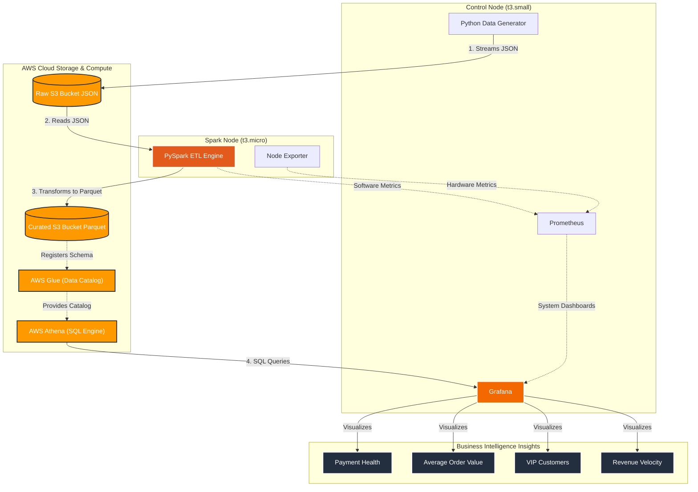

# AWS Distributed Data Lakehouse & Observability Platform

A comprehensive, end-to-end cloud data engineering and observability platform built entirely on the AWS Free Tier. This project demonstrates how to ingest, transform, and visualize real-time streaming data using a distributed microservices architecture.

## 🏗 Architecture Overview



To circumvent the heavy resource constraints of the AWS Free Tier (1GB-2GB RAM), the architecture is split across two distributed EC2 instances communicating securely within a Private VPC.

### 1. The Control Node (`t3.small`)
The centralized hub for data generation and system visualization.
* **Data Generator**: A custom Python script simulating real-time e-commerce financial transactions, writing JSON payloads directly to an AWS S3 Raw Landing Zone.
* **Grafana**: The visualization engine used to construct real-time Business Intelligence dashboards and system observability metrics.
* **Prometheus**: Scrapes hardware and software metrics from all nodes across the private network.

### 2. The Spark Node (`t3.micro`)
The heavy-duty data transformation engine.
* **PySpark / Delta Lake**: Runs inside a containerized Jupyter Notebook environment. It continuously streams raw JSON data from S3, applies schema validation and data casting, and writes highly-optimized columnar Parquet files back to an S3 Curated bucket.
* **Node Exporter**: Exposes system-level metrics (CPU, RAM, Disk) back to the Control Node's Prometheus instance.

---

## 🛠 Tech Stack

* **Infrastructure as Code (IaC):** Terraform
* **Cloud Provider:** Amazon Web Services (EC2, S3, IAM Profiles, VPC)
* **Data Processing / ETL:** Apache Spark (PySpark), Delta Lake format
* **Data Lake & Compute:** AWS S3 (Storage), AWS Athena (Serverless SQL Compute), AWS Glue (Data Catalog)
* **Observability & BI:** Grafana, Prometheus, Node Exporter, Docker Compose

---

## 🌊 The Data Pipeline Flow

1. **Ingestion**: `stream_data.py` generates e-commerce transactions (Customer ID, Product Category, Amount, Payment Status) and streams them as JSON into the S3 `raw-landing-zone` bucket.
2. **Transformation**: PySpark (`jupyter_pipeline.py`) reads the raw JSON stream, strictly enforces a schema, and converts the data into Parquet format, dumping it into the S3 `curated-delta-lake` bucket.
3. **Query Engine**: AWS Athena acts as a serverless translation layer. A `CREATE EXTERNAL TABLE` query registers the Parquet files into the AWS Glue Data Catalog, allowing standard SQL queries over the S3 object storage.
4. **Visualization**: Grafana queries AWS Athena using the Athena Data Source plugin (auto-provisioned) to render real-time Business Intelligence dashboards.

---

## 📊 Dashboards & Analytics

The project ships with a suite of industry-standard e-commerce Business Intelligence panels:

* **Payment Health (Success vs. Failure Rate)**: A Pie Chart tracking payment gateway stability.
* **Average Order Value (AOV) by Category**: Bar Gauges highlighting the most lucrative product verticals.
* **Top 10 VIP Customers (Whales)**: A tabular view of the highest-spending customers.
* **Real-Time Revenue Velocity**: A time-series analysis of sales-per-minute to detect immediate drops in conversion rates.

---

## 🚀 Deployment Instructions

### 1. Provision Infrastructure
Configure your AWS credentials, then deploy the infrastructure using Terraform:
```bash
cd terraform
terraform init
terraform apply -auto-approve
```
*Note: This automatically sets up the IAM Instance Profiles, eliminating the need for hardcoded AWS access keys.*

### 2. Start the Data Generator
SSH into the Control Node and start the data stream:
```bash
python3 generator/stream_data.py
```

### 3. Start the PySpark ETL
SSH into the Spark Node and execute the transformation pipeline:
```bash
python3 jupyter_pipeline.py
```

### 4. Access Grafana
Navigate to `http://<CONTROL_NODE_PUBLIC_IP>:3000`. Grafana is automatically provisioned with the Athena Data Source.
Navigate to the **Explore** tab to write custom SQL queries against your Data Lakehouse, and click "Add to Dashboard" to build your custom visual command center!

---

## 🧹 Tear Down
To avoid AWS charges, ensure you destroy the infrastructure when finished:
```bash
cd terraform
terraform destroy -auto-approve
```
